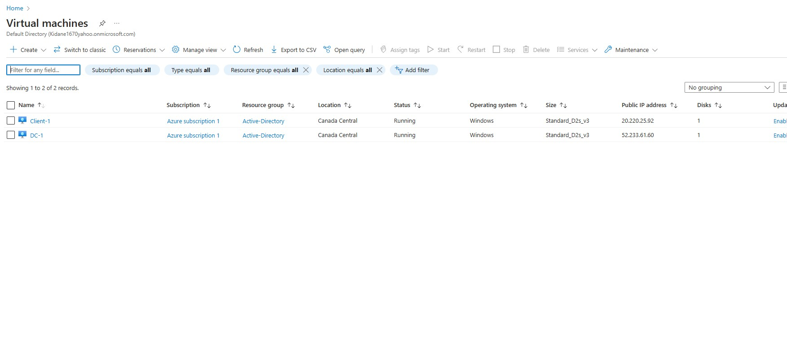
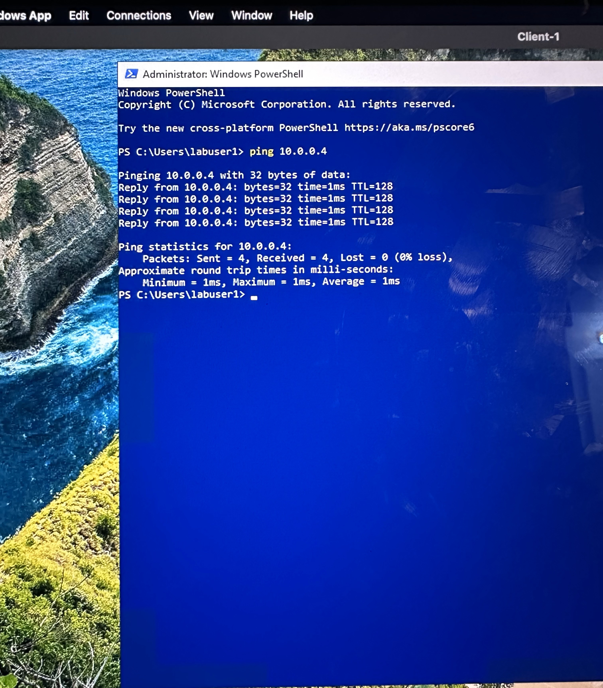
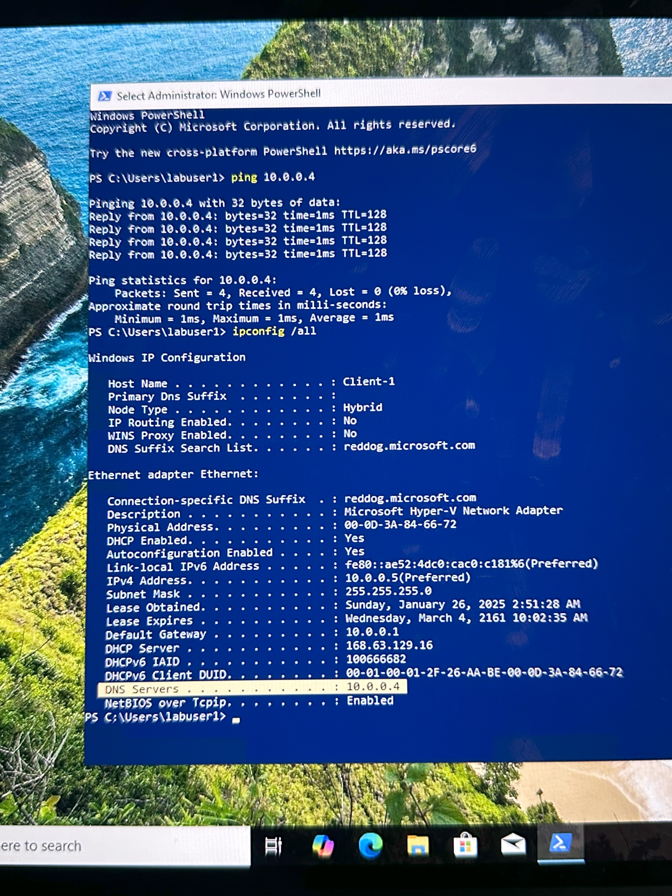

<h1>On-premises Active Directory Deployed in the Cloud (Azure)</h1>
In this tutorial, I will outline the steps to deploy and implement an on-premises Active Directory environment within Azure Virtual Machines. AD is a software solution designed to centrally manage thousands of user accounts, including passwords, permissions, and other settings, from a single location. 

<h2>Environments and Technologies Used</h2>

- Microsoft Azure (Virtual Machines/Compute)
- Remote Desktop
- Active Directory Domain Services
- PowerShell

<h2>Operating Systems Used </h2>

- Windows Server 2022
- Windows 10 (22H2)

<h2>Deployment and Configuration Steps</h2> 

Using Azure, I created two virtual machines, naming one DC-1 and the other Client-1. 
 
 After that, I configured the client-1s DNS in Azure by setting the DNS server to DC-1s private IP, so that whenever Client-1 tries to access a website or any other resource, it will query DC-1(meaning DC-1 is Client-1s DNS server). Next, I used PowerShell to ping DC-1's private IP from Client-1 to verify the connection, and it was successful. 

 Then, I ran ipconfig /all to check if DC-1's private IP would appear in the DNS server section, and it did. 

 

 

Lorem ipsum dolor sit amet, consectetur adipiscing elit, sed do eiusmod tempor incididunt ut labore et dolore magna aliqua. Ut enim ad minim veniam, quis nostrud exercitation ullamco laboris nisi ut aliquip ex ea commodo consequat. Duis aute irure dolor in reprehenderit in voluptate velit esse cillum dolore eu fugiat nulla pariatur.

 

<!--<h2>Video Demonstration</h2> - ### [YouTube: How to Deploy on-premises Active Directory within Azure Compute]--> 
<!--(https://www.youtube.com)<h2>High-Level Deployment and Configuration Steps</h2>

- Set-up Azure Vms
- Configure Vms
- Step 3
- Step 4
-->

